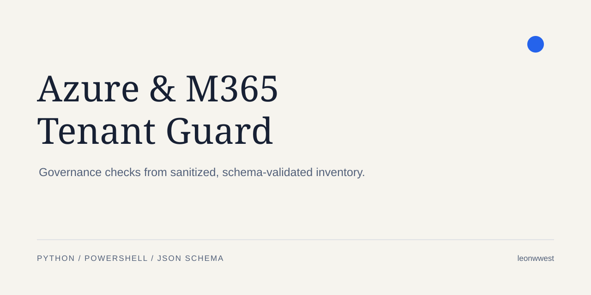
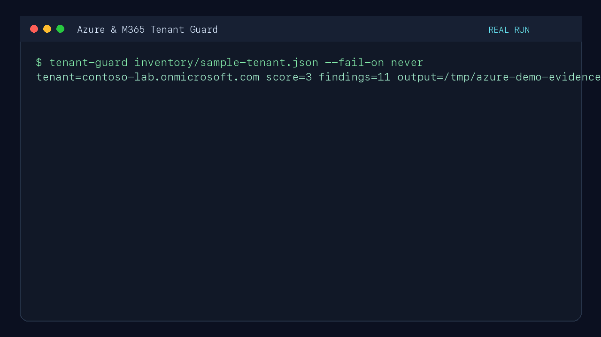
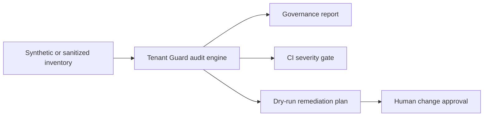

# Azure & Microsoft 365 Tenant Guard

[](https://github.com/leonwwest/azure-m365-automation-lab/actions/workflows/ci.yml)
[](https://github.com/leonwwest/azure-m365-automation-lab/actions/workflows/security.yml)



A portfolio lab for Azure and Microsoft 365 governance automation. Tenant Guard turns a committed
synthetic inventory—or a locally sanitized export—into reviewable identity, application,
Conditional Access, monitoring, network and tagging findings. Its public evidence covers local,
subscription-free execution; the architecture keeps tenant discovery read-only and remediation
behind an explicit approval boundary.

## Recruiter quick view

| Question | Evidence in this repository |
|---|---|
| What is automated? | Sanitized inventory export, deterministic governance checks and report generation |
| What is the safety boundary? | Discovery is read-only; every remediation remains a dry run until approval |
| What can be verified? | Seven tests, 11 deterministic sample findings, Ruff, CodeQL, Trivy and an SPDX SBOM |
| What is production-aware? | Data minimization, trust boundaries, severity, review, rollback and documented limitations |

### Real execution evidence

The recording captures the Tenant Guard CLI running against the committed sanitized inventory,
followed by the repository's test suite. The commands, sample input and generated report path are
all available in this repository for independent reproduction.



## What the project demonstrates

- read-only Microsoft Graph export with deliberate data minimization;
- deterministic checks for privileged MFA, inactive roles, stale guests and emergency access;
- enterprise-application ownership and credential-expiry checks;
- Conditional Access baseline evaluation;
- Azure public-access, diagnostic-settings and governance-tag checks;
- machine-readable JSON, recruiter-friendly Markdown and a dry-run remediation plan;
- CI quality gates, unit tests and a documented review/rollback workflow;
- a strict boundary between audit evidence and approved tenant changes.



## Quick start

```bash
python3 -m venv .venv
source .venv/bin/activate
pip install pytest ruff
PYTHONPATH=src python -m tenant_guard.cli inventory/sample-tenant.json \
  --output reports/latest --fail-on never
pytest -q
```

The command creates:

- `audit-report.json` for automation and dashboards;
- `audit-report.md` for a review or change ticket;
- `remediation-plan.json`, always marked `dry-run` and approval-required.

## Example rule catalogue

| Area | Example rule | Severity |
|---|---|---:|
| Entra ID | Privileged identity has no registered MFA | Critical |
| Entra ID | Privileged identity inactive for more than 30 days | High |
| Guests | Guest inactive for more than 90 days | Medium |
| Applications | Credential expired or expires within 30 days | Critical/High |
| Conditional Access | No enabled MFA grant policy | High |
| Azure network | Public network access enabled | High |
| Azure Monitor | Diagnostic settings missing | Medium |
| Governance | Owner, cost center or environment tag missing | Low |

The demonstration score is a transparent, documented local heuristic. Microsoft Secure Score is
outside this lab's evidence scope.

## Safe tenant export

`powershell/Export-SanitizedInventory.ps1` requests read-only Graph scopes. It omits UPNs, mail
addresses, object IDs and credential values. Real exports belong in `inventory/private/`, which is
ignored by Git, and still require a manual privacy review before sharing.

Azure Resource Graph data can be mapped into the same inventory contract. The checked-in sample
contains only fictional resources.

## Repository map

```text
src/tenant_guard/           Audit engine, CLI and report renderers
inventory/                  Synthetic public inventory contract
powershell/                 Read-only export and dry-run review helpers
tests/                      Rule, report and CLI tests
docs/architecture.md        Trust boundaries and data flow
docs/runbook.md             Evidence, triage, approval and verification workflow
```

## Interview discussion points

- Why read-only discovery and change execution are separate trust boundaries.
- How a deterministic rule produces reproducible evidence instead of opaque AI output.
- Why privileged identities, service principals and public endpoints receive different severity.
- How CI can gate on critical findings without applying a tenant change.
- How the same inventory contract could feed Power BI, Log Analytics or a ticket workflow.

## Scope and limitations

The committed evidence uses synthetic data and a sanitized-export pattern. It demonstrates
automation design, PowerShell/Python integration, governance reasoning, testing and documentation
without requiring production tenant access. A tenant rollout would add tenant-specific policy,
privileged access management, change approvals, rollback planning and post-change verification.

## License

MIT
