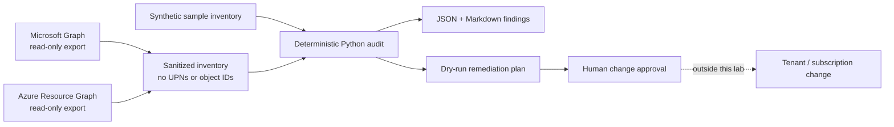

# Architecture and operating model

The lab separates evidence collection, decision logic and change execution:

1. **Collection** uses read-only permissions and produces a sanitized contract.
2. **Evaluation** is deterministic and testable without access to a tenant.
3. **Planning** converts findings into proposed actions with explicit approval flags.
4. **Execution** is intentionally outside the repository. The included PowerShell reviewer
   refuses plans whose mode is not `dry-run`.

This boundary makes the project safe to clone and useful in interviews: every rule can be
explained, reproduced and tested without claiming productive tenant administration.

